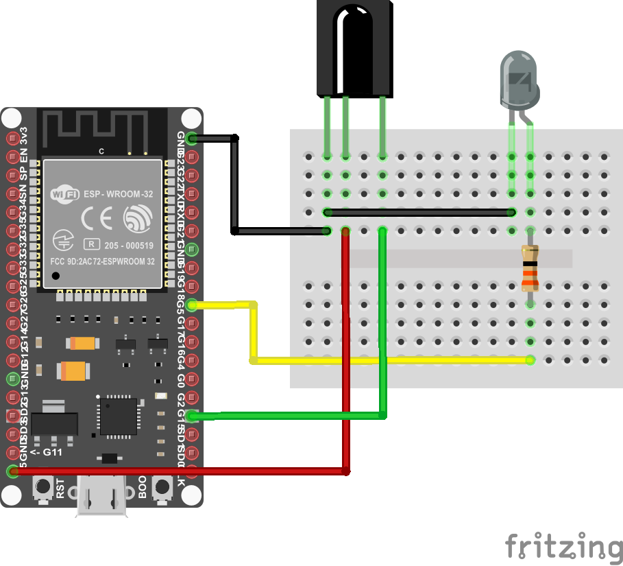

# SEM
SEM project 2019/2020

## Hardware vybavení
1. Infračervená LED, 5mm, vlnová délka 940 nm
2. IR přijímač s tvarovačem
3. Rezistor cca 33 Ohm
4. ESP32 devkitc v4

## Zapojení
IR LED je nutné zapojit do GPIO 5 a IR přijímač je nutné zapojit do GPIO 15 viz. obrázek.

## Software vybavení
1. Arduino IDE
2. Naimportovat IRremote kihovnu (obsažená ve složce lib/IRremote) do složky Arduino/libraries (knihovnu IRremote nelze stáhnout, protože v ní byly provedny změny nutné pro správné fungování této aplikace)
3. Mobilní aplikace pro Google Android sestavená ve složce build

## Spuštění
Po úspěšném naprogramování ESP32 a instalaci mobilní aplikace, je možné pomocí mobilní aplikace se připojit k ESP32 a začít odesílat a přijímat kódy. V mobilní aplikaci jsou předpřipravené dva ovladače (LG, WD). Pro získávání a uložení kódů slouží v aplikaci Custom ovladač, u kterého lze ukládat různé kódy na předem připravené tlačítka. Přijaté a uložené kódy jsou v ESP32 perzistentně uloženy.  
